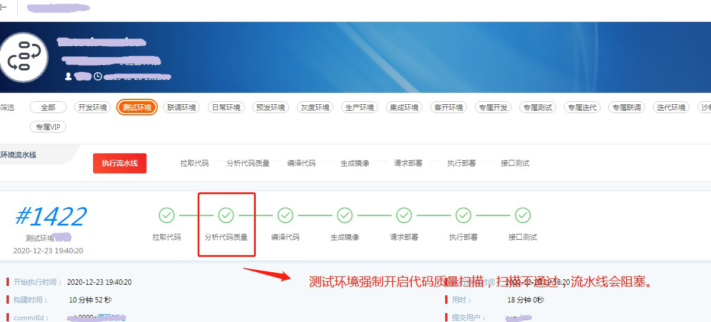
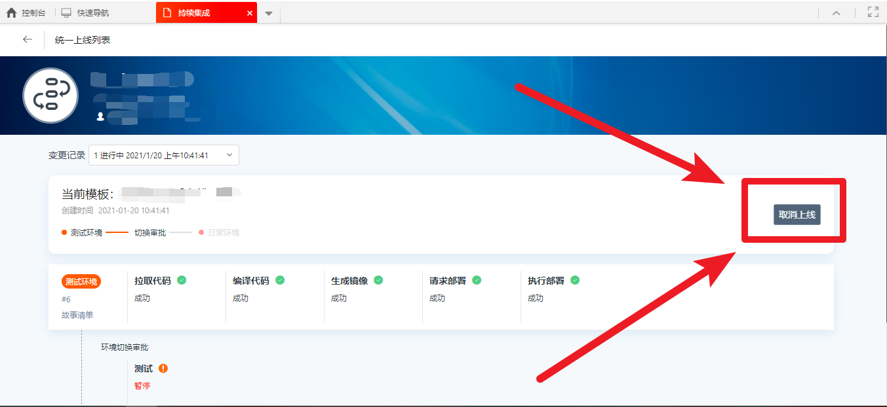

# 上线模板使用说明

- [上线模板使用说明](#上线模板使用说明)
- [上线流程](#上线流程)
- [操作步骤](#操作步骤)
  - [1：点击测试环境执行部署流水线操作](#1点击测试环境执行部署流水线操作)
  - [2：发起上线](#2发起上线)
  - [3：测试人员审批](#3测试人员审批)
  - [4：查看上线流程所在环节](#4查看上线流程所在环节)
- [取消上线](#取消上线)
- [常见问题](#常见问题)
  - [正在上线中,请勿重复提交](#正在上线中请勿重复提交)
    - [解决办法](#解决办法)

目前**质量管理部门**推动上线模板管理。

**一个上线流程内，测试环境执行完，审核通过后才可以点击日常环境的“执行流水线”。**

# 上线流程

完整的上线流程如下：

# 操作步骤

## 1：点击测试环境执行部署流水线操作

测试环境会开启代码质量扫描(sonar),扫描通过后才执行下面的节点，扫描不通过后，点击分析代码节点，查看详细扫描结果。

## 2：发起上线

测试环境部署完毕后，研发想需要部署在日常环境，发起上线申请

选择自己的变更记录，发起上线，如下图所示：

## 3：测试人员审批

测试人员会受到发起上线的通知，选择通过或者不通过

## 4：查看上线流程所在环节

点击右上角的上线地图，如下图所示：

# 取消上线

点击右上角的【上线地图】，选择要取消的版本，点击【取消上线】，如下图所示：

# 常见问题

## 正在上线中,请勿重复提交

发起上线的时候报错：【正在上线中,请勿重复提交】，如下图所示：

### 解决办法

[取消上线](#取消上线)之后，在重新发起上线。取消上线的操作步骤如下：[取消上线](#取消上线)

