# 新版控制台使用引导

## 1、登录

- a、访问开发者中心官网，点击【控制台】进行登录，登录成功进入后台。
- b、点击【登录】按钮进行登录，登录成功后停留在当前页面回显账号信息支持退出登录，在此点击【控制台】也可进入后台。

## 2、全部产品

- a、点击【全部产品】，查看所有菜单信息，支持在菜单面板中按照新旧名称进行关键词查询。
- b、菜单面板右侧产品动态展示已上线和即将上线的产品动态信息。
- c、hover在某个服务上，可以对该服务进行收藏或者取消收藏。

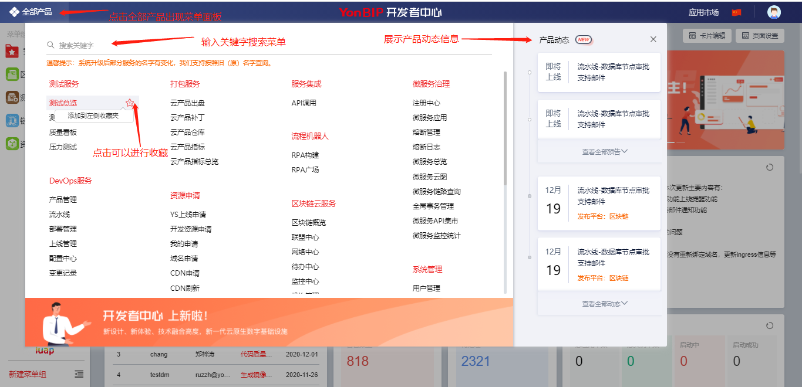

## 3、菜单分组

- a、左侧菜单分组默认收起只展示图标，可手动展开或收起。点击顶部【➕】或底部的【新建菜单组】文字按钮（展开面板时显示）进行菜单组创建。

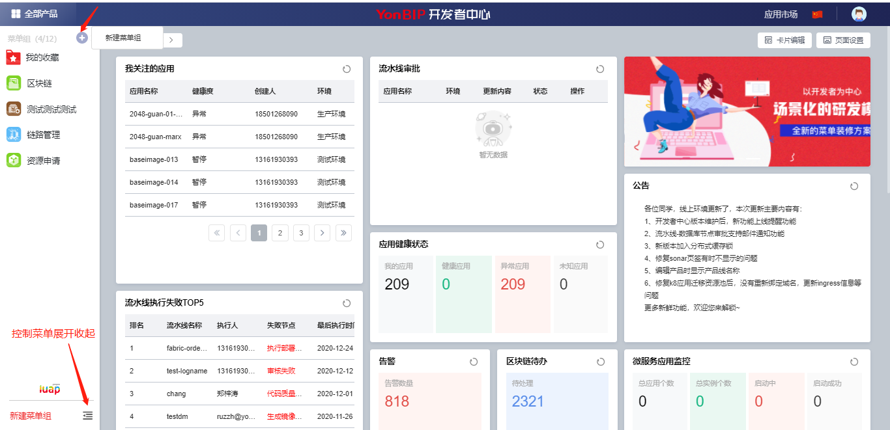

- b、新建菜单组，名称限制12个字符，服务数不超过12个。

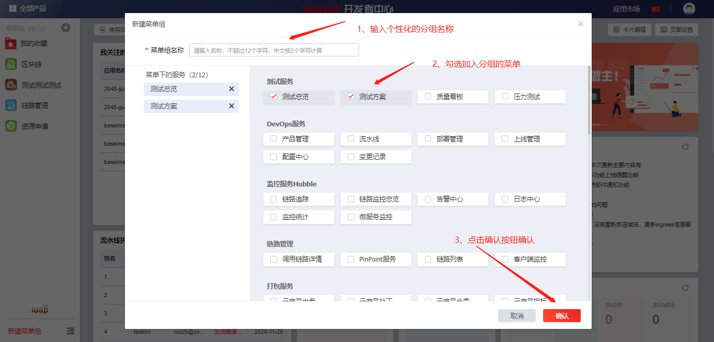

- c、每一个菜单组hover之后会展示分组下的服务，点击【编辑】可以进行菜单分组的编辑，编辑过程同新建菜单，同时可以点击【删除菜单组】按钮（此按钮在编辑状态下出现）删除此分组。

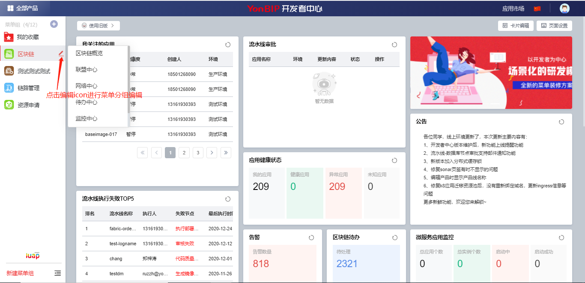

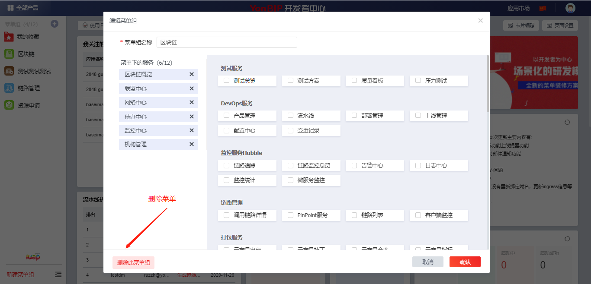

- d、菜单分组的悬浮菜单可以点击，点击进入相应的页面，并且打开二级服务菜单面板，也可关闭二级菜单面板或进行菜单组编辑。

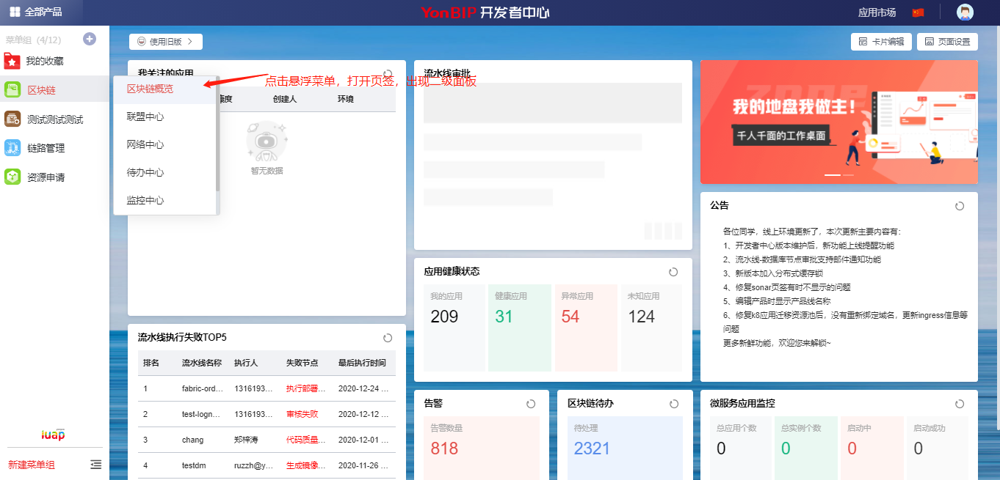

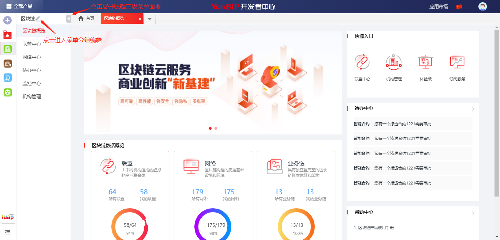

## 4、控制台首页

- a、新旧版之间的切换

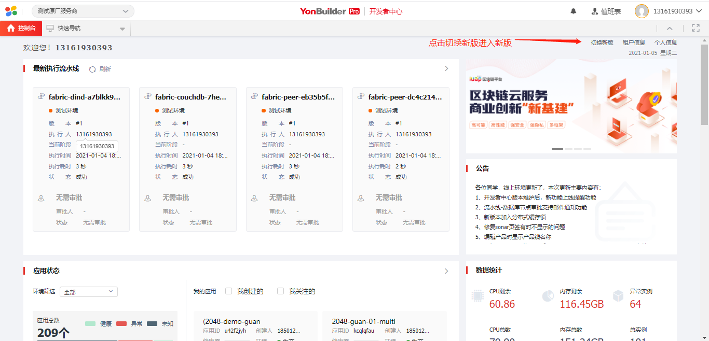

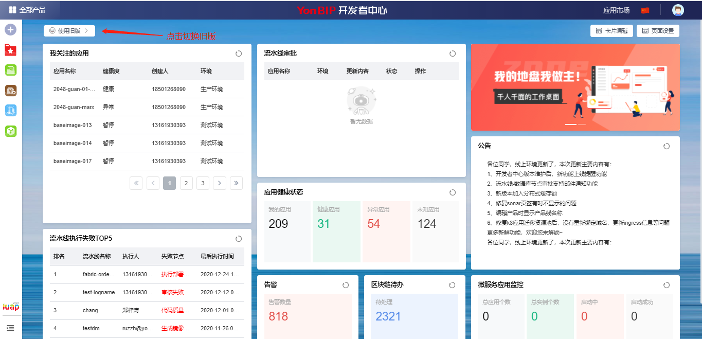

- b、自定义控制台

点击【卡片编辑】按钮进入编辑页面，可以对首页内容进行拼装组合。卡片支持通过拖拽改变位置和大小，支持编辑卡片的属性、删除已有卡片、新增卡片，恢复默认的卡片设置等。

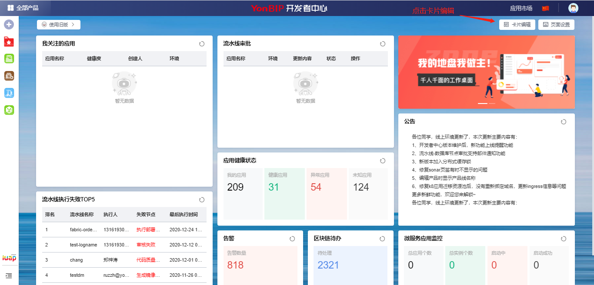

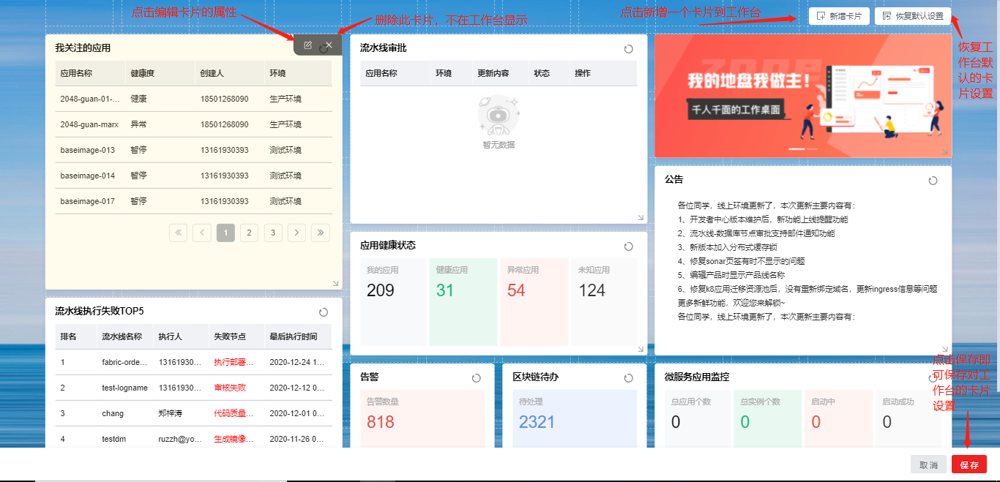

点击右上角的【新增卡片】左侧滑出卡片编辑面板，点击面板上相应的组件自动添加到画布中，可以通过拖拽对其调整。

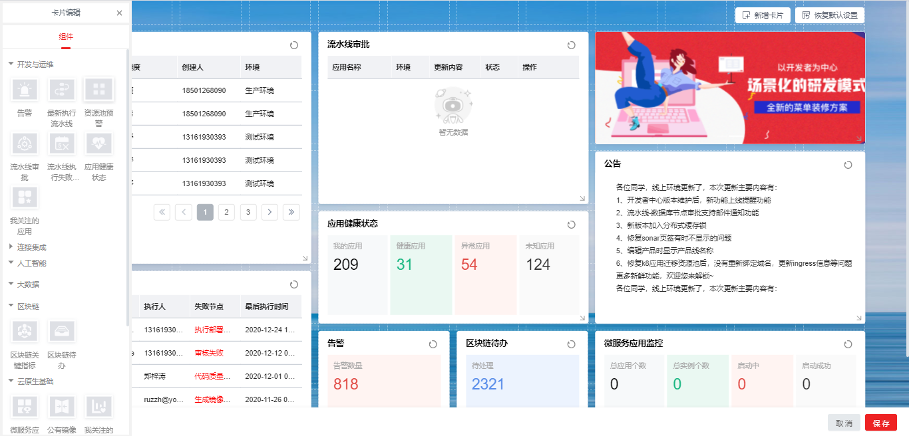

点击【页面设置】，可以设置工作台页面属性，页面的宽度、对齐方式、背景颜色等，选择设置背景图片之后，还可以设置背景图片的模糊度、透明度等。

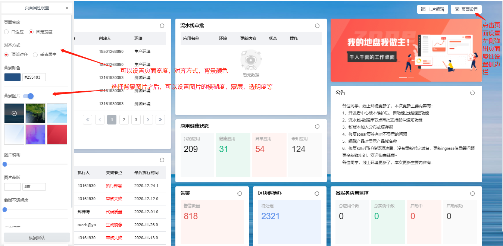

## 5、切换服务商

点击右上角头像展开个人信息面板，点击【服务商名称】，然后选中要切换的服务商之后进行确定，即可切换到选中的服务商。

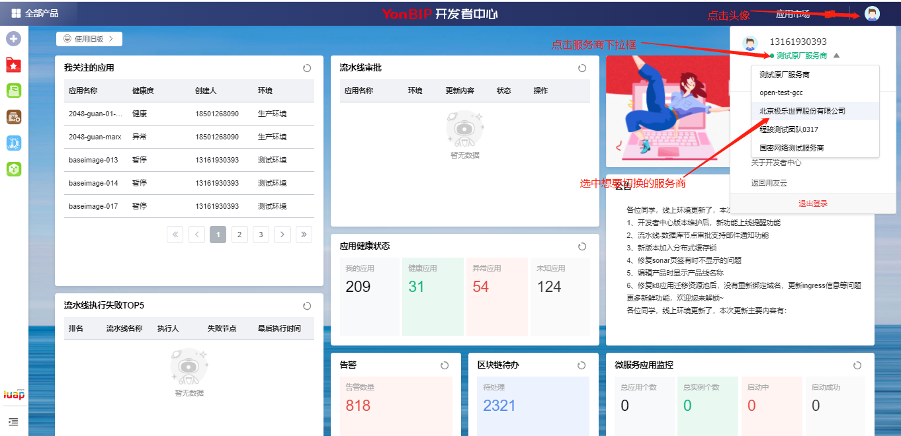