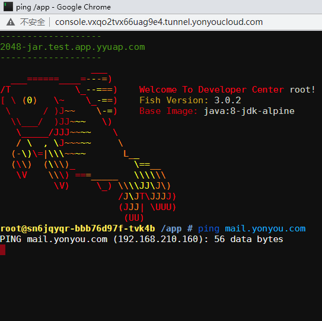
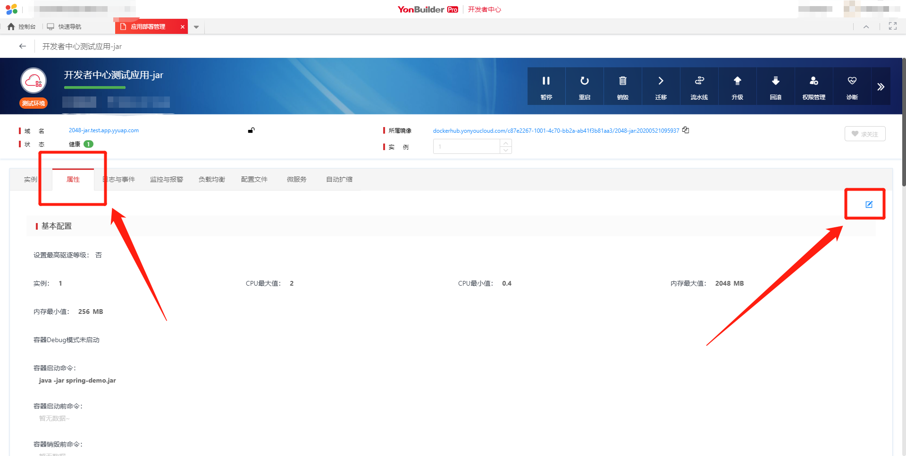
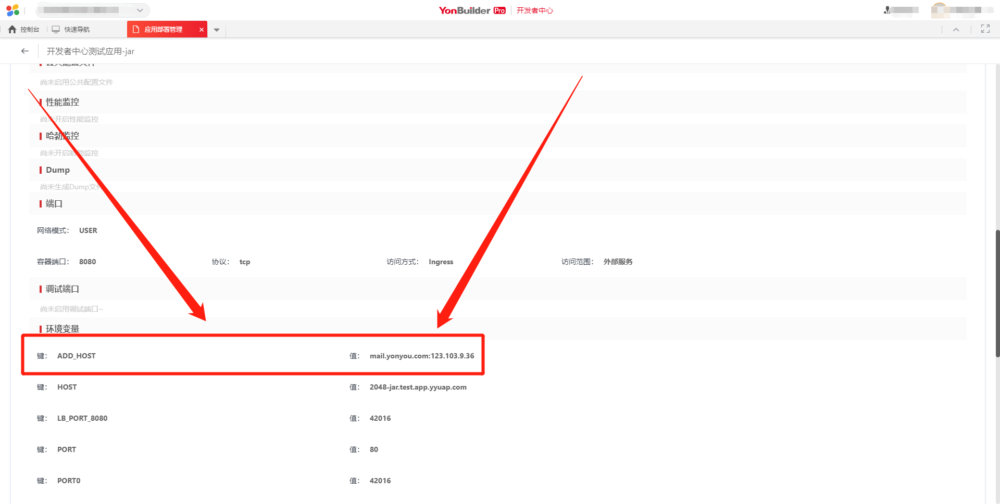
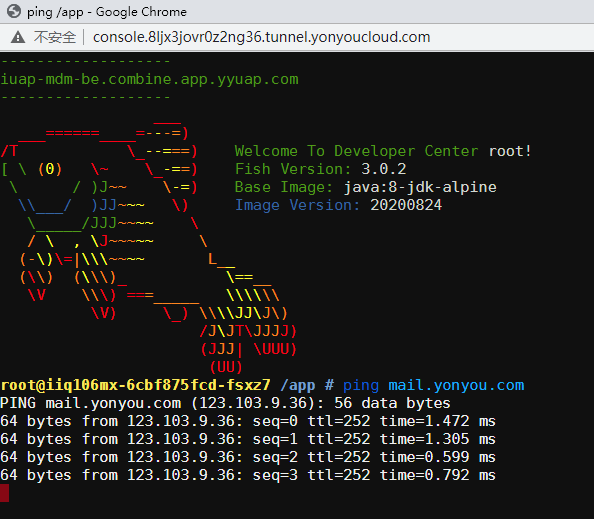

# 不能访问 mail.yonyou.com

mail.yonyou.com 内网 IP 为：`192.168.210.160`，开发者中心的某些环境应用的 IP 网段是 `192.168.0.0/16`，导致在开发者中心的某些环境里面不能访问 mail.yonyou.com，如下图所示：

解决办法是访问 mail.yonyou.com 的公网 IP: `123.103.9.36`，接下来介绍详细的步骤。

## 在【应用部署管理】里面增加环境变量

登录开发者中心，进入【应用部署管理】，找到应用，点击【属性】页签，点击【编辑】按钮，如下图所示：

找到【环境变量】，增加一个环境变量，其中：

> 键: `ADD_HOST`
> 
> 值: `mail.yonyou.com:123.103.9.36`

添加之后的结果如下图所示：

等待应用健康之后，就可以访问 mail.yonyou.com 了，如下图所示：

