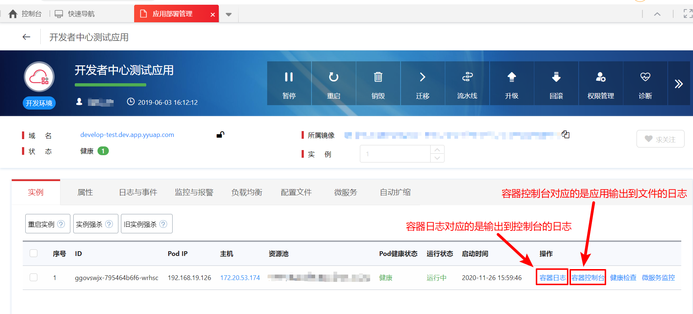

# 查看应用日志

查看应用的日志有 4 中方法：

- [查看应用日志](#查看应用日志)
  - [【容器日志】和【容器控制台】](#容器日志和容器控制台)
  - [【日志与事件】](#日志与事件)
  - [通过 kubernetes 查看应用日志](#通过-kubernetes-查看应用日志)
    - [查看 POD 对应的 namespace](#查看-pod-对应的-namespace)
    - [查看应用的控制台日志](#查看应用的控制台日志)
    - [查看应用的文件日志](#查看应用的文件日志)
  - [通过 docker 查看应用日志](#通过-docker-查看应用日志)
    - [查看 POD 的容器 ID](#查看-pod-的容器-id)
    - [查看应用的控制台日志](#查看应用的控制台日志-1)
    - [查看应用的文件日志](#查看应用的文件日志-1)

接下来分别介绍一下。

## 【容器日志】和【容器控制台】

登录开发者中心，打开【应用部署管理】-【实例】，可以查看【容器日志】和【容器控制台】，如下图所示：

<div align=center>



</div>

注意：

- 【容器日志】对应的是：应用输出到控制台的日志
- 【容器控制台】对应的是：应用输出到文件的日志(如果不熟悉 Linux 命令，可以查看[Linux 常用命令](./common_linux_command.md))

## 【日志与事件】

登录开发者中心，打开【应用部署管理】-【日志与事件】，可以查看已经收集的日志信息，如下图所示：

<div align=center>


</div>

## 通过 kubernetes 查看应用日志

获取应用的 pod_id([如何获取应用的 pod_id](./get_pod_id.md))：ggovswjx-795464b6f6-wrhsc。

### 查看 POD 对应的 namespace

登录 kubernetes master，查看 POD 对应的 namespace：

```shell
# 查看 POD 所在的 namespace
$ kubectl get po -A | grep ggovswjx-795464b6f6-wrhsc
default-namespace   ggovswjx-795464b6f6-wrhsc                  1/1     Running                0          36m
```

根据查询结果可知，ggovswjx-795464b6f6-wrhsc 对应的 namespace 为：`default-namespace`

### 查看应用的控制台日志

```shell
# 查看 POD 的 log
$ kubectl logs -n default-namespace       ggovswjx-795464b6f6-wrhsc
# -f 是一直查看，不退出
$ kubectl logs -f -n default-namespace       ggovswjx-795464b6f6-wrhsc
# --tail 仅显示最后 100 行
$ kubectl logs -f --tail 100 -n default-namespace       ggovswjx-795464b6f6-wrhsc
```

### 查看应用的文件日志

```shell
# 进入容器
$ kubectl exec -it -n default-namespace       ggovswjx-795464b6f6-wrhsc bash
```

## 通过 docker 查看应用日志

获取应用的 pod_id([如何获取应用的 pod_id](./get_pod_id.md))：ggovswjx-795464b6f6-wrhsc。

### 查看 POD 的容器 ID

登录 POD 所在的主机，查看 POD 对应的容器 ID：

```shell
$ docker ps | grep -v 'k8s_POD_' | grep ggovswjx-795464b6f6-wrhsc | awk '{print $1}'
910a2b266b66
```

根据查询可知，ggovswjx-795464b6f6-wrhsc 对应的容器 ID 为：910a2b266b66。

### 查看应用的控制台日志

```shell
# 查看 POD 的 log
$ docker logs 910a2b266b66
# -f 是一直查看，不退出
$ docker logs -f 910a2b266b66
# --tail 仅显示最后 100 行
$ docker logs -f --tail 100 910a2b266b66
```

### 查看应用的文件日志

```shell
# 进入容器
$ docker exec -it 910a2b266b66 bash
```