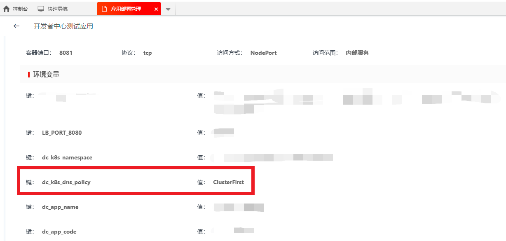

# 设置容器DNS

使用开发者中心的基础镜像，默认的 DNS 为：

```shell
options timeout:1 attempts:1 rotate
; generated by /usr/sbin/dhclient-script
nameserver 10.3.15.14
nameserver 10.3.15.15
```

然而有些情况下，应用需要使用 kubernetes 默认的 DNS 访问 kubernetes 集群内部的 SERVICE。此时可以通过，在【应用部署管理】-【属性】里面，增加环境变量让应用使用 kubernetes 默认的 DNS，增加的环境变量如下：

```shell
dc_k8s_dns_policy = ClusterFirst
```

增加之后的效果如下：

