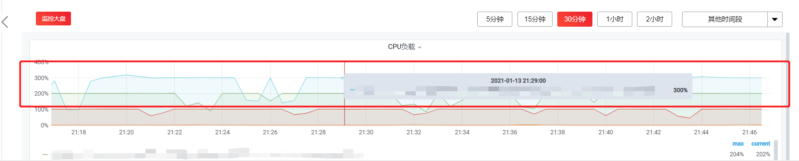

# CPU负载

开发者中心为用户提供了应用的常规监控，包括 CPU、内存、网络等。接下来介绍一下 CPU负载。

CPU负载的计算公式如下：

```
sum by (image,name,instance,id)(rate(container_cpu_user_seconds_total{instance=~"$node",name!~"k8s_POD_.*",name=~".*$container.*",image=~"$image"}[2m])) * 100
```

CPU负载计算的是容器正在使用的CPU核心数，然后乘以100。例如，CPU负载为300%，表示容器正在使用3个CPU，如下图所示：



容器能够使用的最大核心数由 CPU最大值决定。具体参考：[常用关键字释义](keyword_definitions.md)