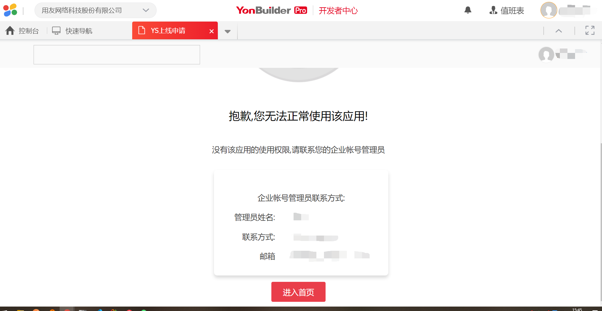
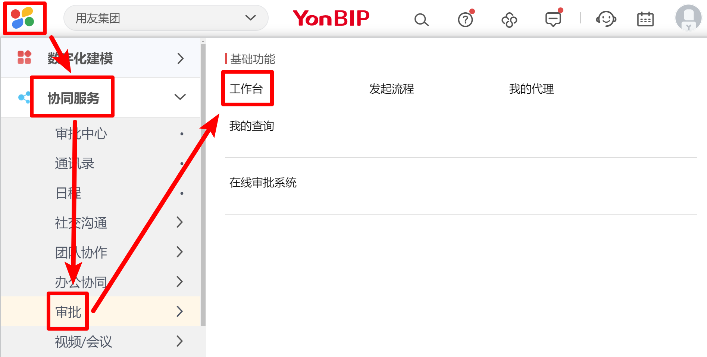
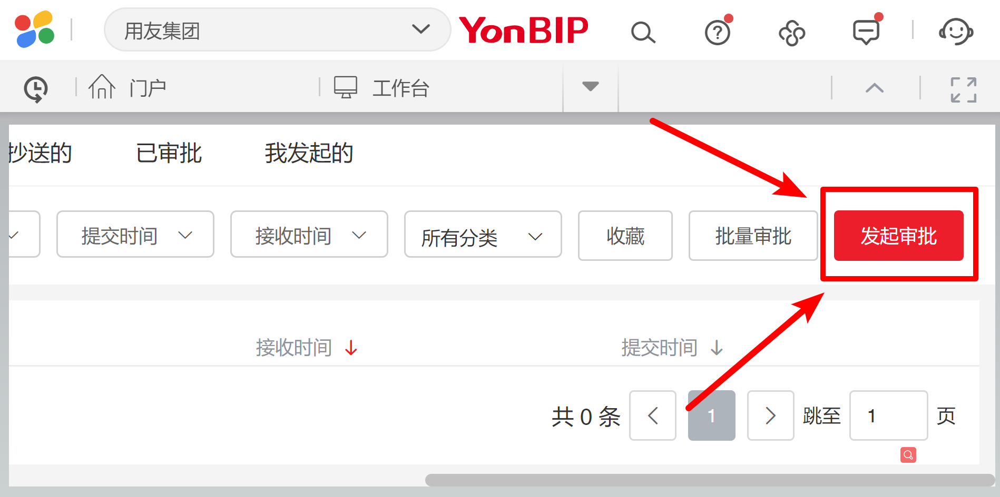
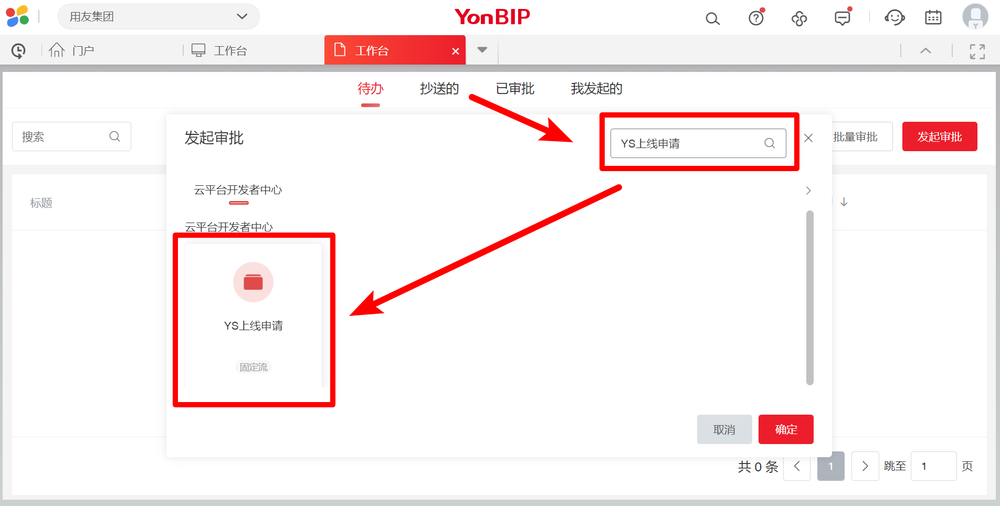
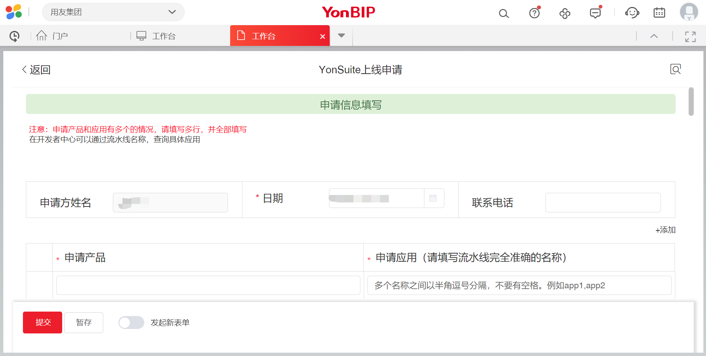

# 云表单没权限的解决办法

- [云表单没权限的解决办法](#云表单没权限的解决办法)
  - [问题现象](#问题现象)
  - [解决办法](#解决办法)

## 问题现象

新用户在开发者中心打开【云审批表单】的时候，会遇到没有权限的问题，如下图所示：

## 解决办法

接下来以【YS上线表单】为例，介绍一下解决办法。

登录 [diwork](https://www.diwork.com)，点击左上角的菜单，依次点击：【协同服务】-->【审批】-->【工作台】，如下图所示：

点击右侧的【发起审批】，如下图所示：

在搜索框内输入【YS上线申请】，并点击搜索出来的表单，如下图所示：

填写【YS上线申请】表单，如下图所示：

