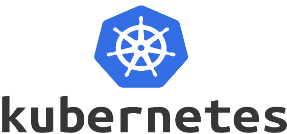
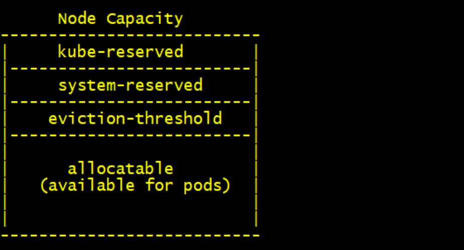
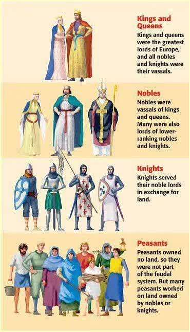
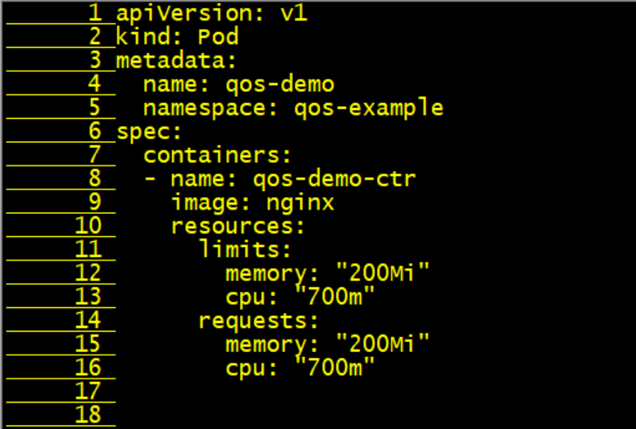
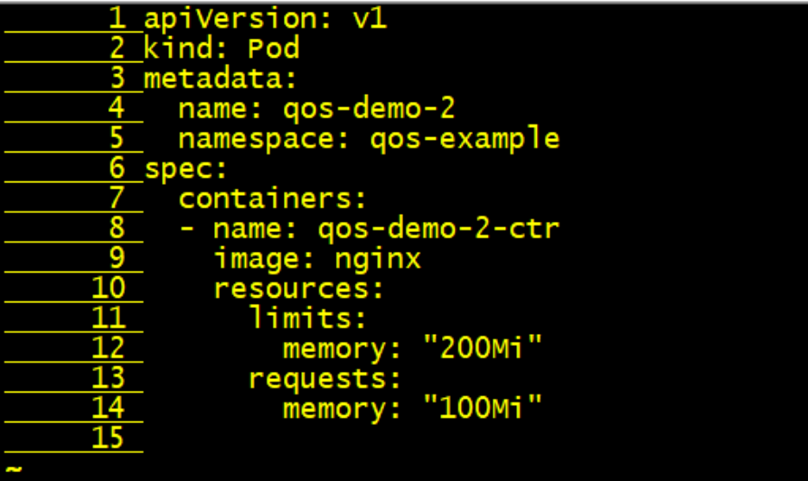
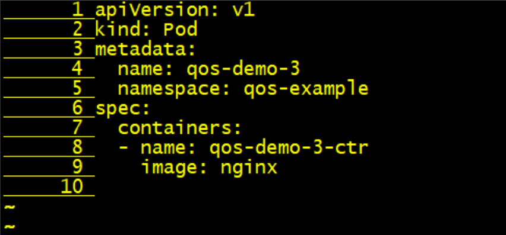
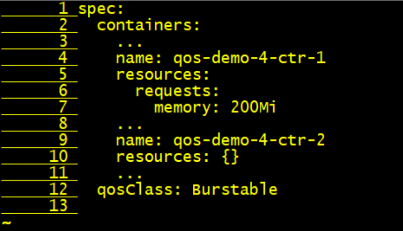
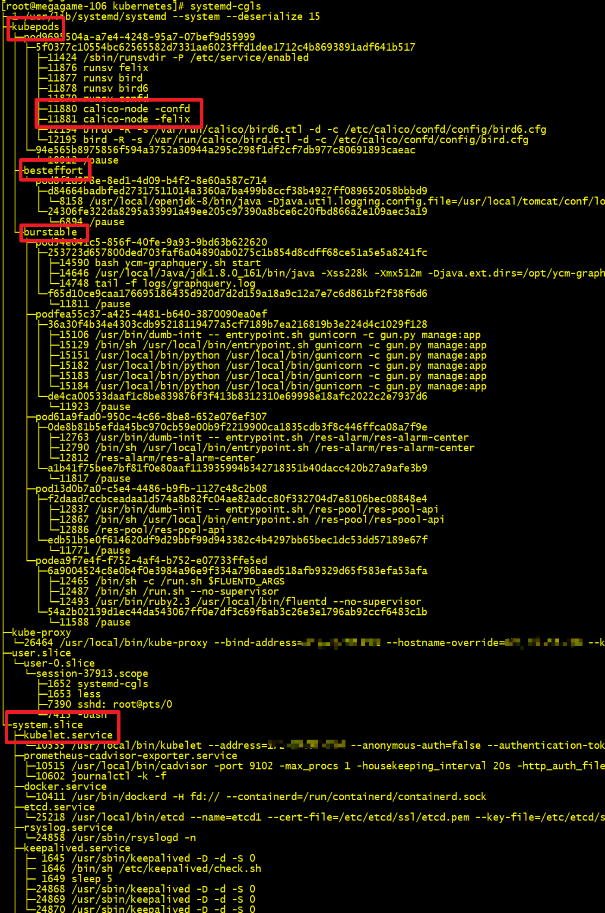
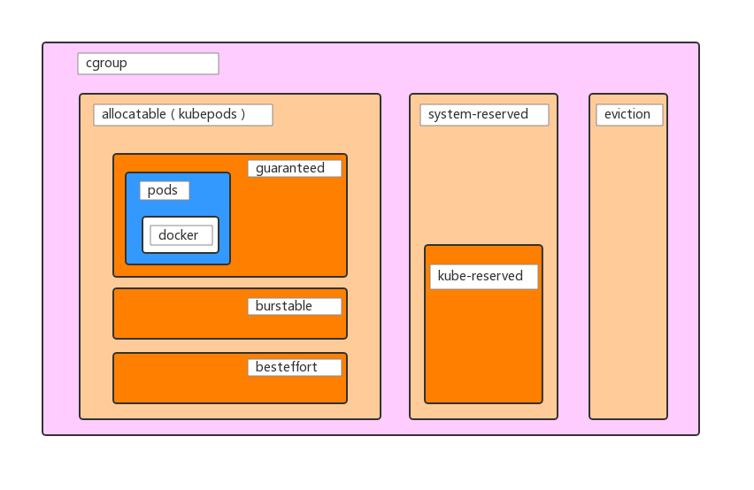

1.  **引导语：**

如果把整个云环境比作一片海洋，kubernetes是管理成千上万艘船只的掌舵人，它管理的船员（容器）可能上千万，每个船员都不一样，总有几个调皮捣蛋的，那么kubernetes是怎么管理这些容器的，如果一台宿主机上某个容器突然资源占用过高，kubernetes应该如何分配保证上面的核心应用可用，服务降级防止雪崩。带着这些问题，咱们来一起看一下kubernetes是如何实现资源管理的。
1.  **Kubernetes中的Node Allocatable**

**1）概述**

一个kubernetes集群，默认情况下pod是使用节点中的全部资源，如果没有给node分配足够的资源，会出现这些pod与系统守护进程或kubelet进程等资源争抢的问题，导致整个node节点资源短缺或不可用的情况。
在kubernetes中把资源分为allocatable（宿主机上pods资源）、eviction-threshold（节点驱逐阈值）、system-reserved（节点资源预留值）、kube-reserved（kubernetes守护进程如kubelet等），node
allocatable是kubernetes API中资源对象的一种，调度器会根据每个节点上node
allocatable的使用情况分配pod，调度器不会超额申请过多的资源。结构图如下所示：



一个集群中某个节点的pod可分配量公式如下：
Allocatable = Node Capacity – (kube-reserved) – (system-reserved) –(eviction-threshold)

可以看到一个节点的pods可用资源需要排除kubernetes为系统预留资源、kubelet守护进程、驱逐阈值这三部分的资源，剩下的就是这个节点真正可以为pod所分配的资源。
**2）pod的QoS**

Kubernetes为每个节点分配了可用资源，那么每个pod的级别是相同的吗？答案是否定的，kubernetes为pod会分配不同级别的角色，像一个国王会分一等公民、二等公民、自由人，如果发生饥荒，比如资源短缺，kubernetes会先把资源分配给最优先的公民，保证它可用。Kubernetes中pod的级别具体划分为：Guaranteed、Burstable、BestEffort三种。


**Guaranteed（一等公民）**：这类pod是有保证的，也是最优先的，在资源不足的情况下，kubernetes优先保证guaranteed格式的pod，驱逐低优先格式的pod保证高优先级的pod。
对于 QoS 类为 Guaranteed 的 Pod：
-   Pod 中的每个容器必须指定内存请求和内存限制，并且两者要相等。
-   Pod 中的每个容器必须指定 CPU 请求和 CPU 限制，并且两者要相等。


上面的配置是包含一个容器的 Pod 配置文件。 容器设置了内存请求和内存限制，值都是200 MiB。 容器设置了 CPU 请求和 CPU 限制，值都是 700 milliCPU

**Burstable（二等公民）**：这类pod可能是比较常见的，它的级别高于BestEffort但低于Guaranteed。它尽量的节省资源同时也保证在资源不足的时候可以优先存活。
对于 QoS 类为 Burstable的 Pod：
-   Pod 不符合 Guaranteed QoS 类的标准。
-   Pod 中至少一个容器具有内存或 CPU 请求。


上面的配置内存的limits和requests值不同。limit为容器使用资源的最大值，request为容器使用资源的最小值。
**BestEffort（自由民）**：这类pod是级别最低的，它的定义是不对内存或者cpu做任何限制，在资源充足的情况下尽可能的使用资源，如果在资源不足的情况下，这类pod会优先被驱逐，保证其他高级别的pod存活。


可以在yaml中查看一台宿主机上的某个pod的qos级别：


1.  **Cgroup原理与对Node Allocatable深入解析**

**1）cgroup概述**

cgroup是control
groups的缩写，它是linux内核的特性，主要的作用是限制、计算和隔离进程的资源使用，包括cpu、内存、磁盘io、网络等方面。
cgroup提供虚拟文件系统作为进行分组管理和各个子系统设置的用户接口，首先先了解一些cgourp的概念。
Task任务，在cgroup中task任务代表一个系统进程
Control group控制族群，control
group控制组主要是通过标准对进程的划分，达到对进程的限定。
Hierarchy层级，control
group可以通过hierarchy组成一个层级树，下层cgourp继承父节点的属性。
Subsystem子系统，指定资源，比如cpu、内存等的资源调度控制器，负责cgourp下的资源控制功能。
如下图所示，cpu和内存两个子系统都有各自的层级结构，同时又通过task任务调用取得相互的联系。


[图片引用地址](https://www.ibm.com/developerworks/cn/linux/1506_cgroup/img001.png)

**2）kubernetes上node节点的cgroup层级**

在kubernetes中可以指定cgroup driver，支持'cgroupfs', 'systemd'这两种驱动类型，默认是cgroupfs，可以在kubelet中通过--cgroup-driver参数进行更改。
在centos7中由之前的init系统过度到systemd系统，在系统的开机启动后，会默认把systemd挂载到/sys/fs/cgroup中，可以通过systemd-cgls来查看系统的cgroup层级结构。
如下所示，一台node节点的croup层级结构：


可以在上面的cgroup层级结构来回顾第一章节的kubernetes中Node
Allocatable概念，可以看到：

-   BestEffort、Burstable、Guaranteed（没有命名）的父级cgroup为kubepods cgroup

-   kubepods和system.slice cgroup同级，并列在系统cgroup之下

-   每个pod下也有属于自己的cgroup和层级结构
>   可以使用systemd-cgtop命令来查看每个cgroup的资源占用情况。


查看node节点中配置参数如下：


```
--enforce-node-allocatable=pods,kube-reserved,system-reserved

--kube-reserved-cgroup=/system.slice/kubelet.service

--system-reserved-cgroup=/system.slice
```

可以通过如下结构图来说明kubernetes中Node Allocatable的croup关系



通过kubernetes使用cgroup对资源的限制，把一个node节点上哪些资源给system使用，哪些资源给kubelet等kubernetes组件使用，最后的资源给node节点上运行的pod。并且kubernetes会划分pod不同的优先级，保证在资源不足的情况下可以让核心pod稳定运行，通过驱逐优先级低的pod来保证node节点资源充足。
